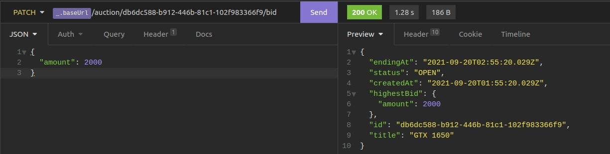

# Auctions API

### A Serverless API that allow us to create auctions for any items using the AWS infraestrutucture using the serverless framework.
 
 
In this project im use the following resources of AWS:

- Lambda
- API Gateway 
- DynamoDb

 

##### An auction is close after one hour and you need to uncomment the line 54 and 55 in the serverless.yml.^^

## Routes

- /auction - `POST`

  `REQUEST`: Receive in the body the name of the item that will be created.  
  `RESPONSE`: Status code `201` and an JSON with details.

 

- /auctions - `GET`
  
  `RESPONSE`: Status code `200` and an JSON with all the itens that are on auctions.

 

- /auction/{id} - `GET`
  
  `RESPONSE`: Status code `200` and a JSON with a item that matchs the id receivied by path parameter.

- /auction/{id}/bid - `PATCH`
  
  `REQUEST`: Recieve the value of a auction.  
  `RESPONSE`: Status code `200` and a JSON with a item that matchs the id receivied by path parameter and the new value of the auction.

### [Add delete method]